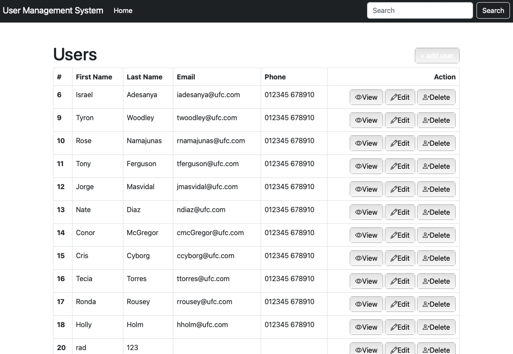
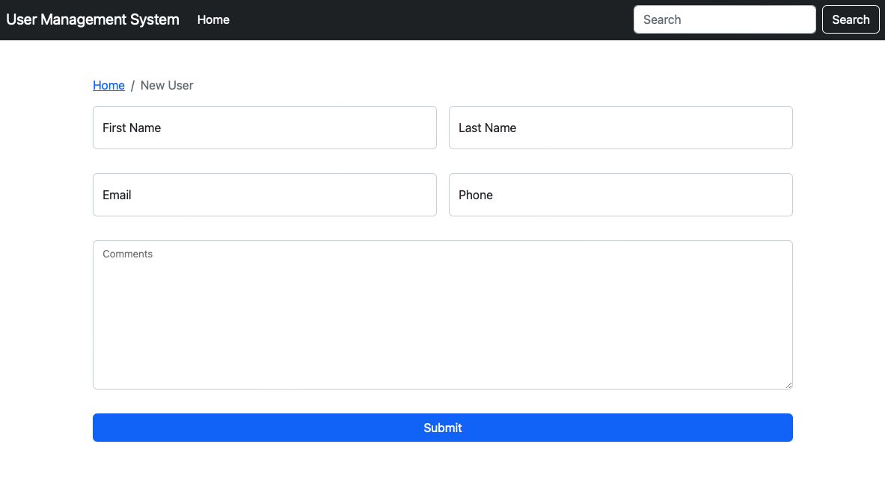

# CRUD USER MANAGEMENT APP

<!-- TABLE OF CONTENTS -->

  
Table of Contents

- [About The Project](#about-the-project)
- [Features](#features)
- [Demo](#demo)
- [Built With](#built-with)
- [Screenshots](#screenshots)

## About The Project

A basic CRUD app to manage employees data.

## Features

- CREATE, REMOVE, UPDATE, DELETE employees
- Save data on database

## Demo

- Github Repo: https://github.com/alvaroormeno/crud-user-mgmt-system

## Built With

- [HTML](https://developer.mozilla.org/en-US/docs/Web/HTML)
- [CSS](https://developer.mozilla.org/en-US/docs/Web/CSS)
- [Bootstrap](https://getbootstrap.com/)
- [JavaScript](https://developer.mozilla.org/en-US/docs/Web/JavaScript)
- [Node.js](https://nodejs.org/en/about/)
- [Nodemon](https://www.npmjs.com/package/nodemon)
- [Handlebars](https://handlebarsjs.com/)
- [Express.js](https://expressjs.com/)
- [DotEnv](https://www.npmjs.com/package/dotenv)
- [MYSQL](https://www.mysql.com/)
- [MYSQLWorkBench](https://www.mysql.com/products/workbench/)

## Screenshots

